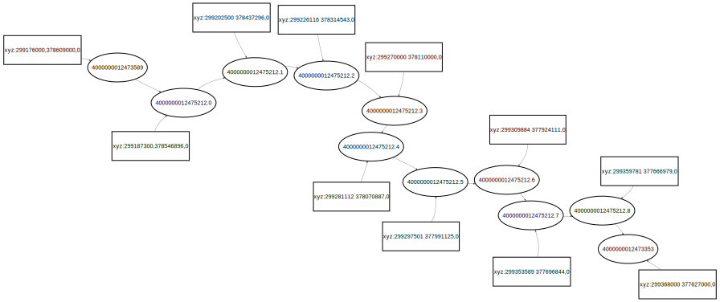

## FIRM2
https://hackmd.io/@jannettasteyn/FIRM2

[toc]

### General Description
This program starts by checking for a file name `.firm2.properties` in the same
directory as the `.jar` file of the program. If the file
does not exist it is created with default values. If the file does exist the 
program checks that all the required properties are in the file and if not 
the missing properties are added with default values or, if environment 
variables exist, it
will use the value from the environment value. Default values are hard coded in
the `SystemProperties` class. This means that if no `.firm2.properties` file 
exists and no environment variables are set the model will still run, and it 
will also create the `.firm2.properties` file which can then be used as a 
template for future configuration.

The hard coded default properties are the following:

|parameter|default| description                                                                                                                  |
|---|---|------------------------------------------------------------------------------------------------------------------------------|
|TOROIDAL|false| True if the model is toroidal (toroidal not yet implemented)                                                                 |
|TICKS|0| If 0 the model will run indefinitely, otherwise the model will run for the number of ticks this value is set to              |
|VISUALISE|TRUE| This is mostly for development and debugging purposes as this framework is not currently aimed at visualisation of the model |
|CELL_SIZE|5|If visualisation is true, each cell will be visualised as a square of this many pixels|
|CHANCE|50|This is a variable that can be used for anything in the implementation of the framework|
|APPLICATION_TITLE|FIRM2|This is the title of the application that will be displayed if visualisation is used|
|INPUT_DATA|/data/inputs/|This is the directory where input files can be found|
|OUTPUT_DATA|/data/outputs/|This is the directory where outputs, including log files are written to|
|TERRAIN_DATA|terrain.json|Terrain data|
|ROADS_DATA|roads.json|The roads network|
|BUILDINGS_DATA|buildings.json|Buildings data|
|DEFENCES_DATA|defences.json|Defences data|
|MODEL_PARAMETERS|globals.json|This file contains default values - should this go into `.firm2.properties`?|
|VEHICLES_DATA|vehicles.json|Vehicle data|
|SLOWDOWN|0|Mostly for visualisation purposes, this value (in milliseconds) can be used to slow the model down|
|TIME_STAMP|1719874800|The Unix timestamp for when the model will start running. Times in the timelin use this as an epoch|
|TICK_TIME_VALUE|60|The number of seconds in a tick|
|OCEAN_DEPTH|4|The depth of the water for cells that are marked as ocean. This means that the land elevation for the cell will be the negative of this number|
|RUN_ON_STARTUP|TRUE|True if the model should start running as soon as the program is started. Mostly for visualisation purposes as there is a button to start and stop the model.|
|VEHICLE_FLOOD_DEPTH|25|Depth of water to force a car to a halt (drowned)|

### Directory Structure
uk.ac.ncl.nclwater.firm2

- AgentBasedModelFramework
- DAFNITest
- examples
- firm2
  - controller
  - model
  - Firm2.java
  - Txt2Json.java
- Main.java


### Agents

- Terrain
- Water
- Defence
- Building
- Vehicle
- Car
- 
### Road Network
Roads are read from the BNG_roads.json file. The GraphStream Java library is
use to work with the graph. Each road has three IDs, the first
being the roadID, the second the ID of the first node in the road and the third
being the last node in the road. Intermediate nodes are numbered using the road
ID plus an integer extension. Eg. The following road (ID 4000000012475212), 
starts at node 4000000012473589 and ends at node 4000000012473353. Intermediate
nodes are numbered with a .# (# being an incrementing integer). Each node
as an attribute called `xyz` which contains the node's co-ordinates. `z` is
always given as `0`.

```
["4000000012475212" "4000000012473589" "4000000012473353" 1000950 
"Single Carriageway" [[299176000 378609000] [299187300 378546896] 
[299202500 378437296] [299226116 378314543] [299270000 378110000] 
[299281112 378070887] [299297501 377991125] [299309884 377924111] 
[299353589 377696844] [299359781 377666979] [299368000 377627000] ]]
```

A graph of the road would look as follows:



### Cars

Cars are of type Agent. Cars enter the model via the timeline. Two cars cannot
enter the timeline at exactly the same time at exactly the same co-ordinates.

The timeline
specifies a start node and an end node for the car. Using the A* algorithm, a
shortest path to the end node is determined. This path is then stored in an
attribute in the Car object. The car starts travelling along this network.
On every tick the car is moved forward along the network by calculating the 
distance travelled in km at the speed limit (mph) given for the road. 
The distance is stored as
the distance from the nearest node. As a car reaches a node, the previous node
is removed and whatever distance was "overshot" becomes the next distance 
travelled. If another car occupies the space the car is meant to move to, the
car waits in its current position until the space is clear. This, in effect,
slows the car down. When the car reaches its destination it stops and stays in
that position. 

If, while the car is travelling along a road, the next node in
the road becomes flooded the car's distance from the last node is negated and
a new shortest path is calculated. The negated distance effectively means the 
car turns around and returns to the last node which is the beginning of its
new shortest path.

If a car finds that the co-ordinates it is meant to travel to is occupied it
will wait for the next tick, effectively slowing it down. Thus, the typical 
N-S algorithm of reducing the speed should not be necessary. (Would this be a
valid assumption? It should probably be tested.)
