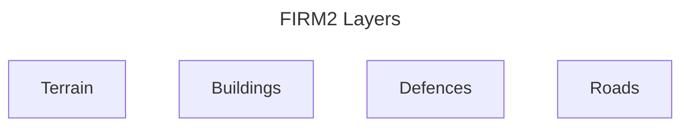

# Layers

The basic framework for this modelling environment consists of several layers of grids. Each grid hosts an agent of a specific type.

```mermaid
---
title: FIRM2 Layers
---

graph TB
    terrain[Terrain]
    buildings[Buildings]
    defences[Defences]
    roads[Roads]
   
    
```