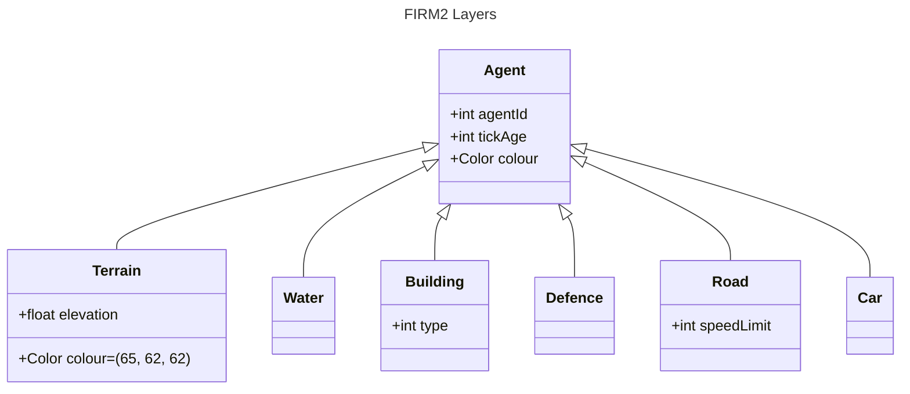
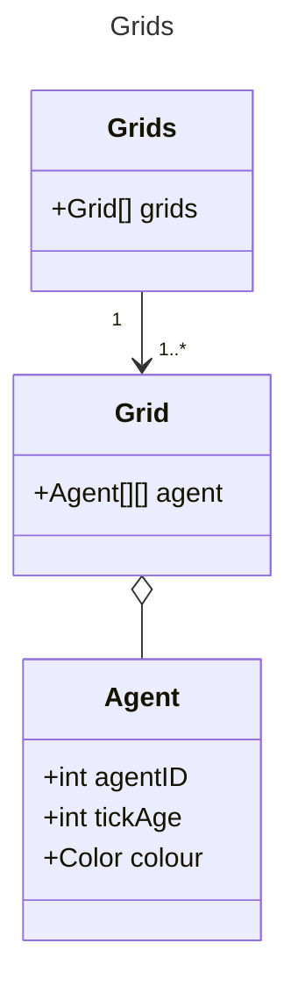
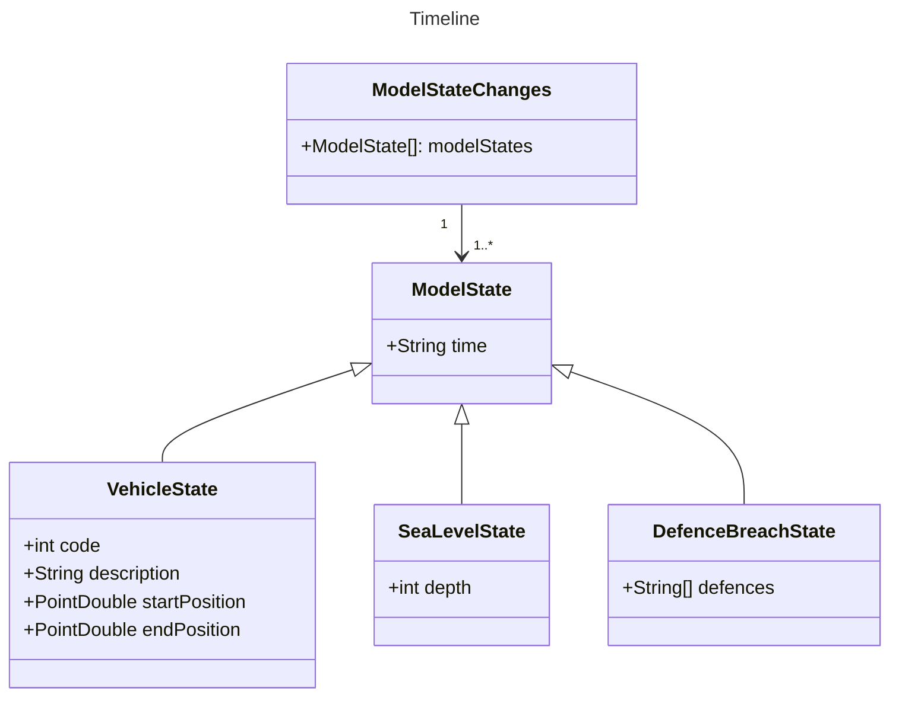

## Layers

The basic framework for this modelling environment consists of several layers of
grids. Each grid hosts agents of a specific type. The grid layers are populated 
from the data files. 

## Agents
Each agent has a default colour that can be changed. For 
instance, the Terrain class has a default value of (65, 62, 62), but during 
initialisation linear interpolation is used to colour the cell based on its 
elevation. 

## Complex Agents 
(This is more a graph than a grid with sections of a specified length - a graph with 
a resolution of 7.5m - a resolution graph)
Because multiple agents such as cars can occupy one cell at any point in time, they don't
fit into the grid concept. Thus, a different type of grid class, ComplexGrid, is used. 
ComplexGrid is not really a grid but rather an ArrayList of Agents (such as cars). Each agent
needs attributes to indicate which grid-co-ordinate it currently occupies. In the case of 
cars, each agent also has a pointer to the road (which is a list of co-ordinates) which the
car will be travelling on.

Agents have to implement the `Agent` abstract class which is in the 
`AgentBasedModelFramework` package.
