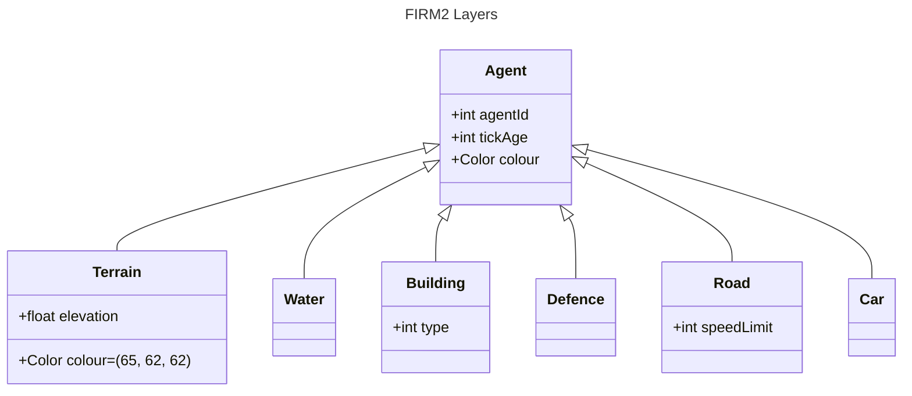

# Layers

The basic framework for this modelling environment consists of several layers of grids. Each grid hosts agents of a specific type. The grid layers are populated from the data files. Each agent has a default colour that can be changed. For instance, the Terrain class has a default value of (65, 62, 62), but during initialisation linear interpolation is used to colour the cell base on its elevation. 

Agents have to implement the `Agent` abstract class which is in the `model` package.
