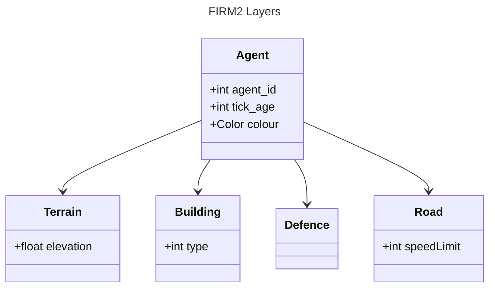

# Layers

The basic framework for this modelling environment consists of several layers of grids. Each grid hosts agents of a specific type.

Agents have to implement the `Agent` abstract class which is in the `model` package.